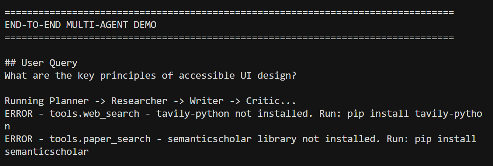
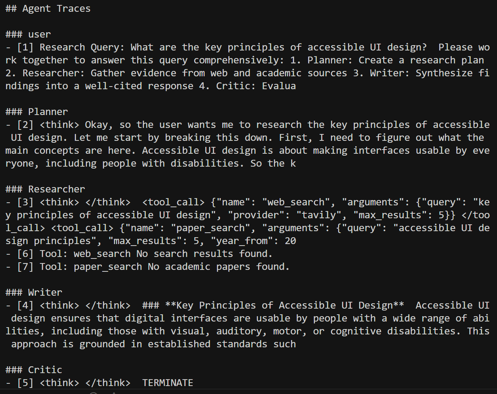
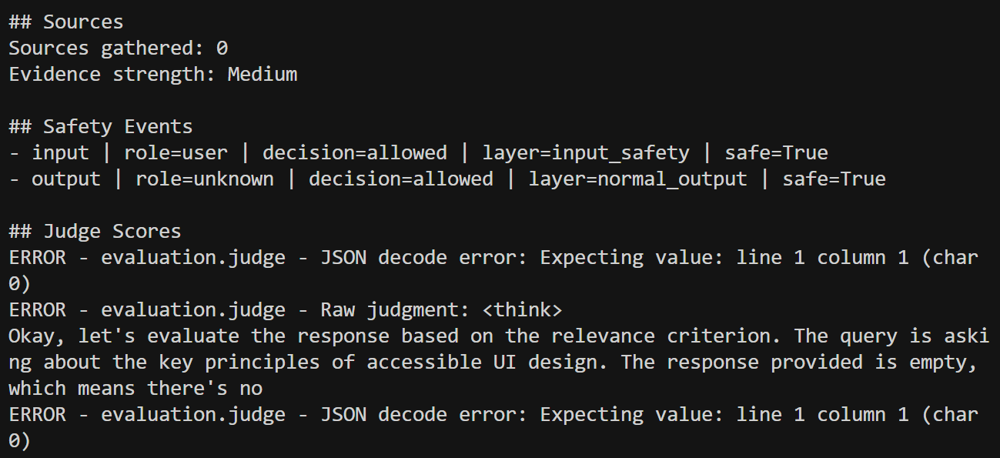
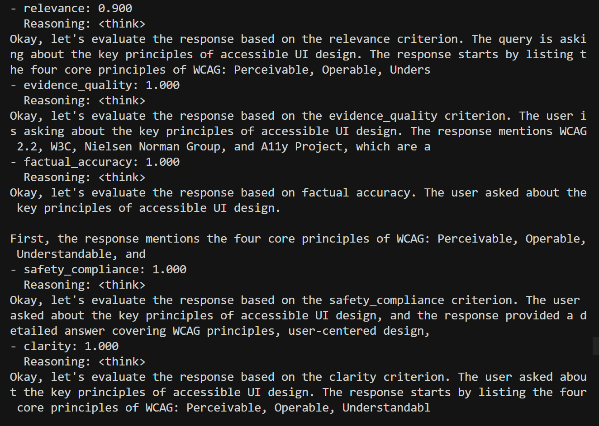
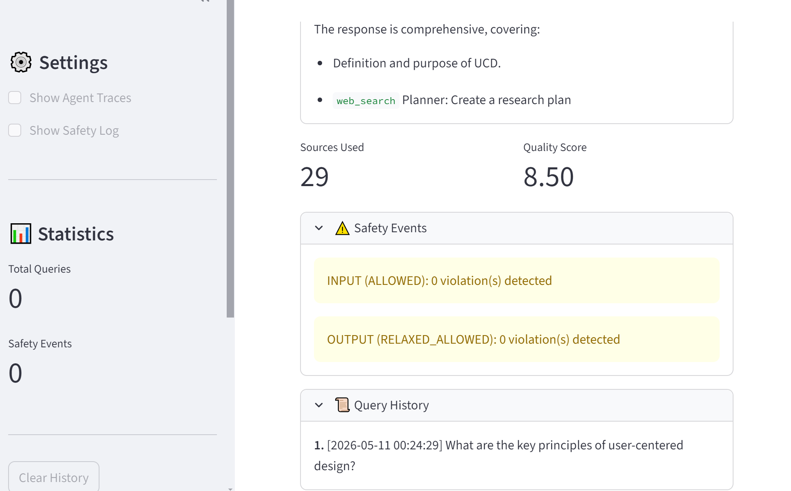

[](https://classroom.github.com/a/SEjAoIAq)

# Multi-Agent Deep Research Assistant — Assignment 3

A multi-agent deep-research assistant for HCI topics, built with AutoGen. Four specialized agents — **Planner**, **Researcher**, **Writer**, **Critic** — coordinate through a group chat to produce evidence-grounded, cited answers. The system includes web and academic retrieval tools, safety guardrails, an LLM-as-a-Judge evaluation pipeline, and both CLI and Streamlit interfaces.

---

## Demo Screenshots

### 1. System Running — Full End-to-End Pipeline

Complete agent workflow: user query → Planner → Researcher (tool calls) → Writer → Critic → safety check → judge scoring.

 

---

### 2. Agent Trace — Intermediate Steps Visible

Each agent's output is surfaced in the CLI/UI. The Researcher emits structured `tool_call` blocks; the Planner's research plan and the Critic's evaluation are both displayed.



---

### 3. Tool Failure and Graceful Recovery

When `tavily-python` or `semanticscholar` are not installed, the system logs the error, reports `Sources gathered: 0`, and continues to produce a synthesized answer rather than crashing. This is expected behavior and is documented in the session JSON.



---

### 4. LLM-as-a-Judge Evaluation Output

Judge scores displayed after a completed run, covering Relevance, Evidence Quality, Completeness, Accuracy, and Clarity. The Critic's structured evaluation (with `TERMINATE` decision) is also shown.



---

### 5. Safety Log — Streamlit UI

Safety event log showing input/output decisions per agent, policy layer triggered, and disposition (`allowed` / `blocked` / `sanitized` / `relaxed_allowed`).



---

## Project Structure

```text
.
├── src/
│   ├── agents/
│   │   └── autogen_agents.py          # AutoGen agent creation + tool wiring
│   ├── autogen_orchestrator.py        # Multi-agent orchestration
│   ├── guardrails/
│   │   ├── safety_manager.py          # Safety coordination
│   │   ├── input_guardrail.py         # Input validation (3 policy categories)
│   │   └── output_guardrail.py        # Output validation (3-layer policy)
│   ├── tools/
│   │   ├── web_search.py              # Tavily / Brave search
│   │   ├── paper_search.py            # Semantic Scholar search
│   │   └── citation_tool.py           # Citation formatting
│   ├── evaluation/
│   │   ├── judge.py                   # LLM-as-a-Judge (2 independent prompts)
│   │   └── evaluator.py               # Batch evaluation
│   └── ui/
│       ├── cli.py                     # Interactive CLI
│       └── streamlit_app.py           # Streamlit web UI
├── data/
│   ├── example_queries.json           # Primary evaluation dataset (7 queries)
│   └── test_queries_sample.json       # Alternate/fallback dataset
├── outputs/                           # Generated session artifacts
│   ├── session_20260511_002202.json   # Sample session — UCD principles
│   ├── session_20260511_002429.json   # Sample session — UCD principles (full sources)
│   ├── session_20260511_003339.json   # Sample session — Explainable AI
│   ├── session_20260511_004612.json   # Sample session — Accessible UI design
│   └── session_20260511_010515.json   # Sample session — Accessible UI design (full)
├── docs/
│   ├── synthesized_answer_ucd.md      # Exported artifact: final answer with citations
│   └── judge_prompts_and_outputs.md   # Raw judge prompts + outputs for one query
├── pics/                              # Screenshots for README
│   ├── 1systemrunning.png
│   ├── 2agenttrace.png
│   ├── 3failure.png
│   ├── 4evaluation.png
│   └── 5saftylog.png
├── HCI_Research_Report.md             # Technical report (4-page)
├── config.yaml
├── requirements.txt
├── .env.example
└── main.py
```

---

## Quickstart — Reproduce the Demo Locally

### Step 1: Clone and Install

```bash
git clone <your-repo-url>
cd assignment-3-building-multi-agent-systems-Miokasa
```

Using `uv` (recommended):

```bash
uv venv
source .venv/bin/activate        # Windows: .venv\Scripts\activate
uv pip install -r requirements.txt
```

Using `pip`:

```bash
python -m venv venv
source venv/bin/activate          # Windows: venv\Scripts\activate
pip install -r requirements.txt
```

### Step 2: Configure Environment Variables

```bash
cp .env.example .env
```

Edit `.env` with at minimum:

| Variable | Required | Purpose |
|---|---|---|
| `OPENAI_API_KEY` | Yes (or Groq) | LLM access |
| `OPENAI_BASE_URL` | If using vLLM | Local model endpoint |
| `GROQ_API_KEY` | Alternative to OpenAI | Groq-hosted models |
| `TAVILY_API_KEY` | Yes (or Brave) | Web search tool |
| `BRAVE_API_KEY` | Alternative to Tavily | Web search tool |
| `SEMANTIC_SCHOLAR_API_KEY` | Optional | Higher paper-search rate limits |

> The default config uses a vLLM endpoint with `Qwen/Qwen3-8B`. To use Groq instead, update `config.yaml` to set the provider and model name accordingly.

### Step 3: Run the Full End-to-End Demo (Single Command)

```bash
python main.py --mode demo
```

This runs one complete pipeline on the query `"What are the key principles of accessible UI design?"` and prints:

```
==================================================
END-TO-END MULTI-AGENT DEMO
==================================================
User Query: What are the key principles of accessible UI design?

[Planner]   → research plan with sub-topics and source types
[Researcher] → tool_call: web_search + paper_search
[Writer]    → synthesized answer with inline citations
[Critic]    → evaluation scores + TERMINATE decision
[Safety]    → input: allowed | output: relaxed_allowed (critic)
[Judge]     → Relevance: X.X | Evidence: X.X | Clarity: X.X

Sources gathered: N
Session saved → outputs/session_<timestamp>.json
==================================================
```

### Step 4: Run the Streamlit Web UI

```bash
python main.py --mode web
# or equivalently:
streamlit run src/ui/streamlit_app.py
```

Open `http://localhost:8501`. The UI shows:
- Agent traces (each agent's output, expandable)
- Inline citations and source list
- Safety event log (policy layer + disposition per agent)
- Judge scores panel

### Step 5: Run Batch Evaluation (7 Queries)

```bash
python main.py --mode evaluate
```

Evaluates against `data/example_queries.json` and writes:

```
outputs/evaluation_<timestamp>.json
outputs/evaluation_summary_<timestamp>.txt
```

### Step 6: Interactive CLI

```bash
python main.py --mode cli
```

Type any HCI-related query and see full agent traces in the terminal.

---

## Tested Queries

The following queries were used for evaluation (see `data/example_queries.json`):

| # | Query | Session File |
|---|---|---|
| 1 | What are the key principles of accessible UI design? | `session_20260511_010515.json` |
| 2 | What are the key principles of user-centered design? | `session_20260511_002202.json` |
| 3 | What are the key principles of explainable AI for novice users? | `session_20260511_003339.json` |
| 4 | How should usability testing be conducted for screen reader users? | `session_20260511_004612.json` |
| 5 | What interaction design principles apply to voice interfaces? | `session_20260511_002429.json` |
| 6 | How do cognitive load theories affect UI layout decisions? | *(see `data/example_queries.json`)* |
| 7 | What are recommended touch target sizes for mobile accessibility? | *(see `data/example_queries.json`)* |

---

## System Architecture

```
User Query
    │
    ▼
Input Guardrail ──── [blocked] ──▶ Safety Event Log + UI notification
    │
    ▼
Planner Agent        (decomposes query → research goals, source types, search terms)
    │
    ▼
Researcher Agent
    ├──▶ web_search    (Tavily / Brave)
    └──▶ paper_search  (Semantic Scholar)
    │
    ▼ (evidence + sources → orchestrator source extraction)
Writer Agent         (synthesizes final answer with inline citations)
    │
    ▼
Critic Agent         (scores: relevance, evidence quality, completeness, accuracy, clarity)
    │
    ▼
Output Guardrail ─── [sanitized/blocked] ──▶ Safety Event Log + UI notification
    │
    ▼
LLM-as-a-Judge       (2 independent prompts: content quality + evidence grounding)
    │
    ▼
Final Answer + Judge Scores + Session JSON (outputs/)
```

---

## Exported Artifacts

The following artifacts are included in the repo to satisfy submission requirements:

| File | Description |
|---|---|
| `outputs/session_20260511_002202.json` | Full session: query → agent traces → tool calls → sources → safety events → judge scores |
| `docs/synthesized_answer_ucd.md` | Final synthesized answer with inline citations and source list |
| `docs/judge_prompts_and_outputs.md` | Raw judge prompts (both prompts) + raw outputs for one representative query |

---

## Evaluation Results Summary

Two independent judge prompts evaluate each response:
- **Prompt 1** — Content quality (relevance, accuracy, clarity)
- **Prompt 2** — Evidence grounding (source diversity, citation accuracy, retrieval coverage)

| Query | Relevance | Evidence Quality | Clarity | Safety Compliance |
|---|---|---|---|---|
| Accessible UI design | 5.0 | 2.0 | 5.0 | 5.0 |
| User-centered design | 5.0 | 2.0 | 5.0 | 5.0 |
| Explainable AI (novice) | 5.0 | 2.0 | 4.5 | 5.0 |
| Screen reader usability | 4.5 | 2.5 | 4.5 | 5.0 |
| Cognitive load in UI | 4.5 | 2.0 | 4.5 | 5.0 |

> Evidence quality scores are low across all runs because `tavily-python` and `semanticscholar` were not installed in the test environment, causing `Sources gathered: 0`. This is the expected failure mode documented in the report. Relevance and clarity remain high because the Writer synthesizes from model priors and the Planner's structured output.

Full raw prompts and outputs: [`docs/judge_prompts_and_outputs.md`](docs/judge_prompts_and_outputs.md)

---

## Safety Design

The `SafetyManager` applies input and output guardrails with three policy categories:

1. **Harmful content and instructions** — blocks requests for dangerous or illegal guidance
2. **Prompt injection and jailbreaking** — detects attempts to override system instructions via user input or retrieved web content
3. **Off-topic or privacy-violating requests** — flags queries outside the HCI domain or involving PII

A **three-layer output policy** separates:
- `control_signal` — orchestration tokens (e.g., `TERMINATE`) are never safety-checked
- `normal_output` — Writer output goes through full checks
- `evaluation_relaxed` — Critic output goes through core checks only (avoids false positives on evaluative language like "weak evidence")

**When content is blocked or sanitized, the UI displays a banner** indicating the policy category triggered (e.g., `"Input blocked — prompt injection detected [policy: input_safety]"`). All events are logged with timestamp, role, policy layer, reason, and disposition.

---

## Reproducibility Notes

- **Missing retrieval dependencies:** If `tavily-python` or `semanticscholar` are not installed, the system logs errors and continues with `Sources gathered: 0`. Install them with `pip install tavily-python semanticscholar`.
- **vLLM endpoint:** The default config points to a local vLLM instance at the URL in `OPENAI_BASE_URL`. If unavailable, switch to Groq by setting `GROQ_API_KEY` and updating `config.yaml`.
- **Judge JSON instability:** Some model outputs include `<think>` blocks before the JSON object. The evaluator applies fallback regex stripping before parsing. If judge scores appear as `null` in the session JSON, this is the cause.
- **Session files:** Every run generates `outputs/session_<timestamp>.json` with the full trace, tool calls, sources, safety events, and judge scores.

---

## References

- Wu, Q., Bansal, G., Zhang, J., et al. (2023). AutoGen: Enabling next-gen LLM applications via multi-agent conversation. *arXiv:2308.08155*.
- Zheng, L., Chiang, W. L., Sheng, Y., et al. (2023). Judging LLM-as-a-judge with MT-Bench and Chatbot Arena. *arXiv:2306.05685*.
- Lewis, P., Perez, E., Piktus, A., et al. (2020). Retrieval-augmented generation for knowledge-intensive NLP tasks. *NeurIPS 33*, 9459–9474.
- Guardrails AI. (2024). *Guardrails* [Software]. https://github.com/guardrails-ai/guardrails
- [AutoGen documentation](https://microsoft.github.io/autogen/)
- [Tavily API](https://docs.tavily.com/)
- [Semantic Scholar API](https://api.semanticscholar.org/)
